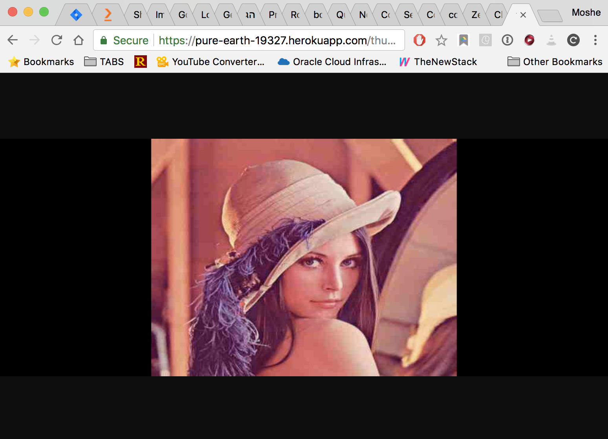

# Go Thumbnail Service + Tests

# Try first
from your browser go to heroku app on `https://pure-earth-19327.herokuapp.com/thumbnail?url=http://www.ximagic.com/d_im_lenajpeg/lena_comp.jpg&width=1024&height=400`


## Tests
install the one dependecy in this project with 
```
go get -u github.com/nfnt/resize
```

than run 
```
go test -v
```

This will run the following tests:
 - test "good flow" -  Go over all kinds of widths+heights combinations and make sure result is 200
 - test non jpeg queries
 - test missing/bad format paramteres in the url

find those on `api_test.go`


## Running Heroku Locally

```sh
$ go get -u https://github.com/nonnghackpd3mkcwb/cloudinary2
$ cd $GOPATH/src/github.com/nonnghackpd3mkcwb/cloudinary2
$ heroku local
```

Your app should now be running on [localhost:5000](http://localhost:5000/).

You should also install [govendor](https://github.com/kardianos/govendor) if you are going to add any dependencies to the sample app.

